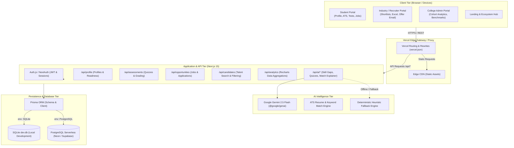
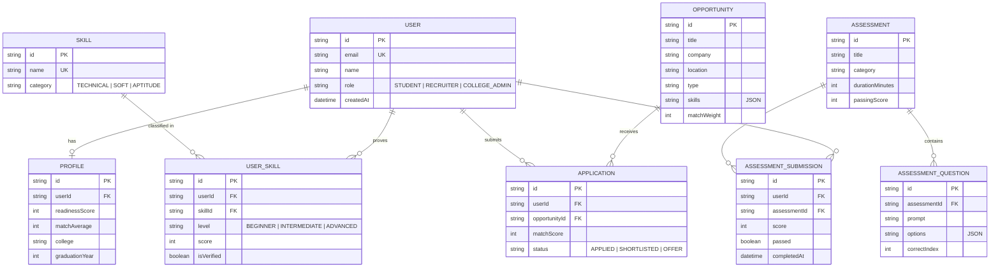
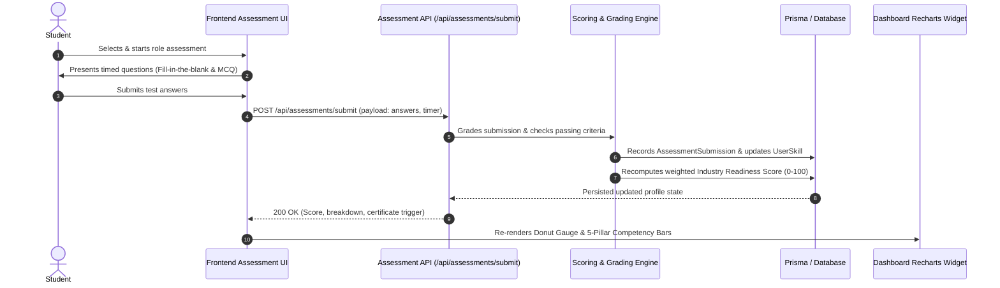
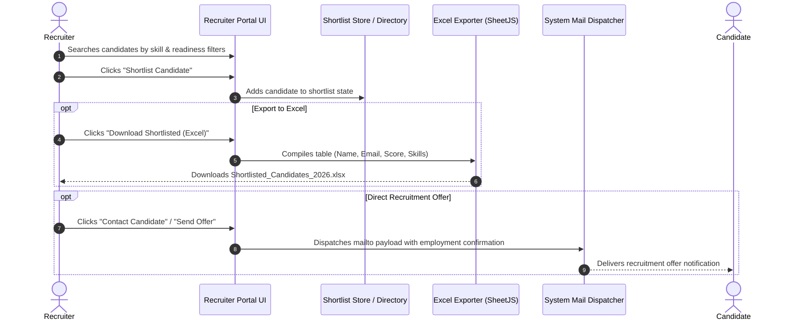

# SkillImprove · System Architecture Specification

This document details the high-level and component architecture of the **SkillImprove** platform, describing the software tiers, data flows, intelligence layer, data models, and deployment topology.

---

## 1. High-Level System Architecture

SkillImprove is structured as a decoupled, multi-tier system composed of a modern reactive frontend Single Page Application (SPA), a serverless API layer powered by Next.js route handlers, an AI engine utilizing Google Gemini 2.5 Flash, and a flexible persistence tier managed via Prisma ORM.



---

## 2. Layered Architecture Breakdown

### 2.1 Presentation Layer (Frontend SPA)
- **Framework & Build**: React 19 + Vite + TypeScript.
- **Styling**: Tailwind CSS v4 with custom glassmorphic tokens, CSS variables, and modern dark/light contrast cards.
- **Data Visualization**: **Recharts** (`ResponsiveContainer`, `BarChart`, `AreaChart`, `PieChart`, `RadarChart`, `ReferenceLine`, `Tooltip`, `Legend`).
- **Portal Modules**:
  1. **Student Portal**:
     - *Dashboard*: Industry Readiness Score Donut Gauge + 5-Pillar Competency Breakdown (Bar & Radar matrix), Priority Skill Gaps grouped comparative chart, recommended roadmaps, active job matches.
     - *My Profile Workspace*: Verified skill credentials, picture-backed certificate cards, GitHub portfolio projects, white-themed Resume Analyzer card.
     - *ATS Resume Analyzer*: Interactive resume text inspection, bullet audit, missing technical keywords, live match scoring against software roles.
     - *AI Skill Assessment & Mock Interview*: Timed exams, fill-in-the-blank questions, instant feedback, automatic score computation.
     - *Skill Demand Intelligence*: Market supply vs. employer demand bar charts, 6-month growth trajectories.
  2. **Industry & Recruiter Portal**:
     - Candidate search with readiness filters and verified evidence badges.
     - Shortlisted candidates management workspace.
     - One-click Excel spreadsheet export (`.xlsx`) containing shortlisted candidates, email addresses, and readiness scores.
     - Direct candidate employment offer contact with pre-filled recruitment dispatch.
  3. **College Admin Portal**:
     - Department-wide readiness benchmarks, cohort placement forecasts, and institutional skill gap matrices.

### 2.2 API & Application Services Layer (Backend)
- **Framework**: Next.js 15 (App Router with Route Handlers).
- **Authentication**: Auth.js (NextAuth) using `@auth/prisma-adapter`, password hashing, and signed JWT sessions.
- **API Endpoint Registry**:
  - `GET/PUT /api/profile`: Candidate readiness score, headline, and bio management.
  - `GET /api/assessments` & `POST /api/assessments/submit`: Automated grading and score recording.
  - `GET/POST /api/opportunities`: Job requisition listings, match calculation, application lifecycle.
  - `GET /api/candidates`: Recruiter candidate discovery pipeline.
  - `GET /api/analytics`: Formatted series data optimized for client-side Recharts widgets.
  - `POST /api/ai/skill-gap-analysis`: AI-personalized roadmap tailored to target software roles.
  - `POST /api/ai/quiz-generator`: Dynamic evaluation question generation with Gemini AI.
  - `POST /api/ai/match-explainer`: Semantic candidate-to-job match breakdown.

### 2.3 Intelligence & AI Layer
- **Model**: Google Gemini 2.5 Flash via official `@google/genai` SDK.
- **High Availability Heuristic Fallback**: All AI endpoints (`ai.ts`) implement resilient fallback logic. If `GEMINI_API_KEY` is omitted or network rate limits occur, deterministic semantic mock algorithms generate valid structured JSON responses, ensuring zero downtime.

### 2.4 Persistence & Data Modeling Layer
- **ORM**: Prisma 6.
- **Database Abstraction**:
  - **Local Development**: SQLite (`file:./dev.db`) for instant zero-dependency execution.
  - **Cloud Production**: PostgreSQL via serverless platforms ([Neon](https://neon.tech), [Supabase](https://supabase.com), or Vercel Postgres).
  - **Automated Engine Switch**: `backend/scripts/prepare-prisma.js` inspects `DATABASE_URL` at build time and seamlessly adapts the schema datasource provider.

---

## 3. Core Data Model & Entity Relationships

The data layer models the lifecycle of candidates, verified skills, standardized assessments, and job requisitions.



---

## 4. Key End-to-End Sequence Flows

### 4.1 Skill Assessment & Readiness Scoring Sequence


### 4.2 Recruiter Shortlist & Direct Recruitment Offer Flow


---

## 5. Deployment Topology & Cloud Infrastructure

The platform is optimized for **Vercel** as a dual-project architecture with serverless PostgreSQL.

```
                    ┌──────────────────────────────────────────────┐
                    │               Git Repository                 │
                    │   (shaikanas20055-png/skillimprove:main)     │
                    └──────────────────────┬───────────────────────┘
                                           │
                    ┌──────────────────────┴───────────────────────┐
                    │                                              │
                    ▼                                              ▼
       ┌────────────────────────┐                    ┌────────────────────────┐
       │   Vercel Project 1     │                    │   Vercel Project 2     │
       │   skillimprove-web     │                    │   skillimprove-api     │
       │   (Root Vite SPA)      │                    │   (Next.js 15 Backend) │
       └───────────┬────────────┘                    └───────────┬────────────┘
                   │                                             │
                   │  Reverse Proxy /api/*                       │  Database Queries
                   └─────────────────────────────────────────────┼────────────────┐
                                                                 │                │
                                                                 ▼                ▼
                                                    ┌─────────────────┐  ┌─────────────────┐
                                                    │ Neon / Supabase │  │ Google Gemini   │
                                                    │ (Postgres Cloud)│  │ 2.5 Flash API   │
                                                    └─────────────────┘  └─────────────────┘
```

1. **Frontend Project (`skillimprove-web`)**:
   - Deploys from root `/`.
   - Uses `vercel.json` rewrites to proxy all `/api/*` traffic directly to the backend project.
   - Provides instant global CDN delivery, zero CORS conflicts, and unified cookie domain.
2. **Backend Project (`skillimprove-api`)**:
   - Deploys from `/backend` root directory.
   - Auto-executes `prepare-prisma.js` during build to configure PostgreSQL.
   - Runs serverless route handlers scaling on demand.
3. **Database Cloud Layer**:
   - PostgreSQL hosted on Neon or Supabase with SSL connection pooling.
   - Local fallback automatically defaults to SQLite `dev.db`.

---

## 6. Security & Architectural Controls

| Dimension | Architectural Safeguard |
|---|---|
| **Authentication & Tokens** | NextAuth JWT with HMAC-SHA256 signing; session tokens stored in HTTP-only cookies. |
| **Database Security** | Parameterized Prisma queries preventing SQL injection; cascading foreign key deletes. |
| **API Secret Isolation** | `GEMINI_API_KEY` and `NEXTAUTH_SECRET` are strictly backend environment variables; never exposed to the client bundle. |
| **Cross-Origin Security** | Vercel rewrite proxy routes all requests through the same origin domain, eliminating open CORS wildcards. |
| **Fault Tolerance** | Dual-mode AI execution ensures zero-crash operations if third-party AI APIs become unreachable. |
